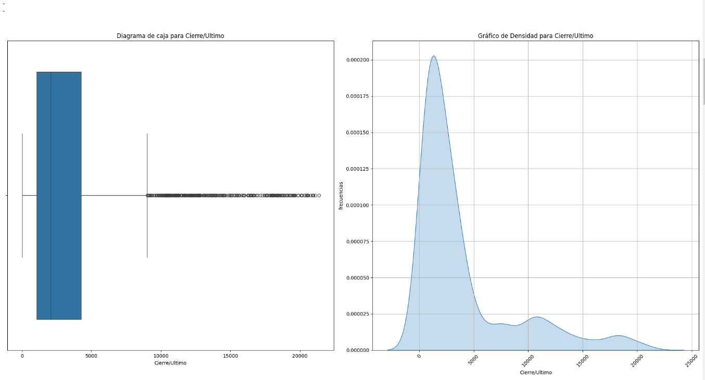
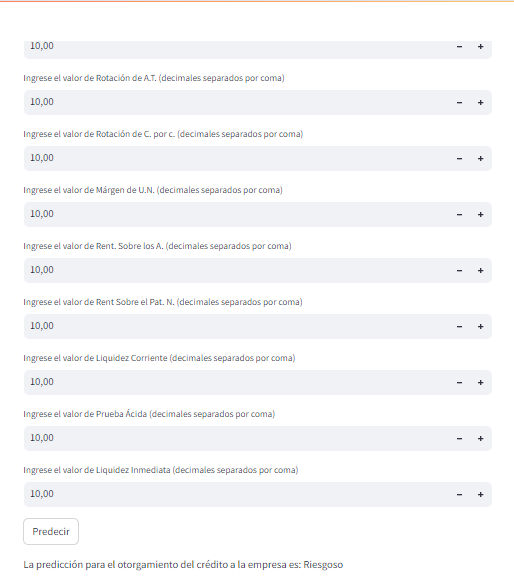

# <h1 align= 'center'>Análisis de Riesgo Crediticio</h1>

  

# Índice

- [Introducción](#Introducción)
- [Objetivos](#Objetivos)
- [Datos](#Datos)
- [Desarrollo](#Desarrollo)
  - [ETL](#ETL)
  - [EDA](#EDA)
  - [Dashboard](#Dashboard)
  - [Modelo](#Modelo)
  - [Deploy](#Deploy)
- [Tecnologías](#Tecnologías)
- [Conclusiones](#Conclusiones)
- [Equipo](#Equipo)

# Introducción

El Banco IPB es una entidad financiera que está ofreciendo creditos para empresas a una tasa de interes muy atractiva como parte de su politica financiera y el contexto economico que se esta dando en Argentina.
En un principio, centra su oferta de credito en los sectores que potencialmente tienen el mayor salto en el desarrollo y expansión actualmente, como son el sector hidrocarburífero, agricola, minero, de ciencias del conocimiento, etc.

  

Para ello, necesita un marco de análisis en conjunto con las herramientas necesarias para estimar el riesgo crediticio que conllevaria autorizar un prestamo a una empresa, lo que brindaria seguridad y garantia de pago al momento de otorgarlo.

Por este motivo, nos contrata a nosotros, la consultora AyC para que le brindemos el soporte para esta toma de decisiones.

# Objetivos

  

Los principales objetivos y condiciones en este sentido son:

* La construccion de un marco analitico donde se puedan realizar la toma de decision principal (el otorgamiento y autorizacion del credito) tomando en cuenta riesgo y garantia.
* El estudio exhaustivo de la situacion general y potencial de la empresa en cuestion, que abarque aspectos de capital, financieros, contables, de sector, de produccion, etc
* La construccion de un modelo o sistema que permita una mirada concisa, precisa y predictiva del comportamiento de la empresa para/con el cumplimiento de pago del prestamo.
* El asesoramiento de ideas y conclusiones que complementen el marco analitico con informacion util y argumentos concretos para la toma de decisiones.

# Datos

En Principio, los datos con los que contamos y vamos a trabajar referidos a la tematica de proyecto, son de diferentes origenes, aunque principalmente se obtienen de la plataforma web de datos publicos de la nacion (tanto en Datos Argentina como en los diferenetes ministerios o la plataforma de la nación).

Detallamos los origenes principales:
* https://kaggle.com/
* https://datos.gob.ar/
* https://www.argentina.gob.ar/
* https://nasdaq.com
* https://inversores.ypf.com/informacion-financiera.html
* https://datos.enerdata.net/productos-petroliferos/estadisticas-consumo-mundial-petroleo-consumo-domestico.html
* https://datos.enerdata.net/petroleo-crudo/datos-produccion-energia-mundial.html

Entre otras. Vale la pena señalar que ademas se utilizó informes e informacion relacionada a la temática del proyecto (informes contables, estudios, balances y estados de resultado de empresas del sector, otros estudios del área, auditorias estatales, etc)

Como se hace notar, nos centramos en la data de empresas petroleras en un contexto general medio apuntamos a el ambito dentro de argentina (el objeto de estudio se centra principalmente en la empresa YPF), aunque complementamos la misma con algunos datos referentes al área (de hidrocarburos) de otras empresas no radicadas en Argentina, y en el contexto global apuntamos a informacion general del sector de hidrocarburos en un contexto amplio para tomar como punto de referencia en diversos analisis.

La data apunta a el estado general de actividad productiva, el estado financiero y/o contable de la empresa y su capital-infraestructura, la proyeccion de produccion y crecimiento, las inversiones que realiza, la cotizacion en bolsa, etc... todo esto, pertinente para tener un panorama claro del estado general de la empresa a evaluar.

Los datos con los que se trabaja son:

* Inversiones de empresas petroleras en Argentina (desde el año 2020 hasta el año 2024)
* Informacion contable sobre YPF
* Cotizaciones de diversas empresas petroleras/ de hidrocarburos en bolsas de EEUU
* Produccion de gas y petroleo en Argentina (desde 2020 hasta 2024)
* Precio internacional del barril de crudo (desde el año 1970)
* Consumo internacional de hidrocarburos por pais
* Reservas de hidrocarburos en Argentina
* Pozos registrados en el pais
* Rentas del petroleo en Argentina (en % de PBI)
* Informacion contable y financiera de diversas empresas de hidrocarburos

Mención aparte a los informes o analisis y benchmark de la temática que utilizamos y que no se registran como datos, ya que nos sirven para tener conocimiento y guia del tema en analisis
y poner en contexto y terminologia, asi como mecanismos y utilizacion de herramientas y logica al material de datos con el que contamos.

# Desarrollo

Resumen Workflow

  

## ETL

En la fase de Transformación de Datos (ETL), se llevaron a cabo una serie de procedimientos para garantizar la preparación adecuada y la limpieza exhaustiva de los datos antes de su carga en el almacén de datos. Estas acciones incluyeron:

- Verificación del tipo de datos de cada columna: Se examinó minuciosamente el tipo de datos de cada columna para garantizar su coherencia y precisión en el análisis posterior. 
- Análisis de la dimensionalidad de los datos: Se exploró la estructura del conjunto de datos para comprender su tamaño y complejidad, lo que permitió una mejor comprensión de la cantidad de registros y variables presentes.
- Manejo de valores nulos: Se identificaron y abordaron los valores nulos en el conjunto de datos mediante técnicas como la imputación de datos o la eliminación de registros incompletos, con el fin de evitar sesgos o distorsiones en el análisis posterior.
- Verificación visual de valores atípicos: Se realizó una exploración gráfica de los datos para detectar posibles valores atípicos o anomalías que podrían afectar la integridad y la precisión de los resultados.
- Indagación de consistencia de los datos: Se llevaron a cabo investigaciones exhaustivas sobre la consistencia de los datos, incluyendo la identificación de máximos, mínimos y rangos de valores para cada variable, lo que ayudó a garantizar la fiabilidad de los datos utilizados en el análisis.

Como paso previo, en algunos casos los ficheros presentaban un formato no adecuado para su transformacion y manipulacion directa por lo que se debia realizar una instancia previa, la extraccion de los datos en formato de tabla, para su posterior manipulación y conversión. Esto se puede ver plasmado en este [notebook](notebooks/tratamiento_ficheros_tabdinamicas.ipynb)

Todas estas acciones en conjunto permitieron la normalizacion, formateo y estructuracion de los datos que obtuvimos en referencia a la tematica. Esta serie de acciones se pueden ver en el notebook [ETL_ipynb](notebooks/ETL.ipynb) donde tambien estan comentados los cambios realizados a cada archivo y su fundamentación.

|                       |                       |
|-----------------------|-----------------------|
|  |  |
| Distribucion de los valores nulos| Correlación entre valores nulos |

Para completar el camino realizado en la Extracción, Transformacion y Carga/disponibilización de los datos ponemos a disposicion dos informes concernientes a informar y detallar el estado de los datos en instancias anteriores a su proceso de ETL y posteriores al mismo:

  
Informe ETL Preliminar

  
  -El [Informe ETL_preliminar](notebooks/Informe_ETL_Preliminar.ipynb) proporciona un análisis detallado de la calidad y las características de los datos originales, y ofrece funciones específicas para examinar y explorar los datos en profundidad. Estas funciones incluyen la visualización de valores nulos, análisis de frecuencia de palabras, boxplots numéricos y más, lo que facilita la identificación de patrones, tendencias y relaciones significativas en los datos.
  
  |                       |
  |-----------------------|
  |  |
  | Parte del analisis realizado en el momento del proceso de ETL a los datos, vemos uno de los campos con datos anidados |

  
Informe EDA Preiminar

  
  -El [Informe EDA_preliminar](notebooks/EDA_preliminar.ipynb) hace incapie en una instancia intermedia entre la carga y disponibilizacion de los datos y su uso puntual en un informe EDA. En el utilizamos funciones que permiten ver graficamente la distribucion de valores de cada campo en cada fichero y su proporcion en el conjunto total, complementando los mismos con estadísticas básicas de los mismos los que nos permiten tener un panorama general al momento de realizar un análisis mas exhaustivo y complejo, es decir, nos permite aproximarnos a los datos de una manera general en un sentido mucho mas estadistico/analítico previo a su estudio.
  
  |                       |
  |-----------------------|
  |  |
  | Distribucion de frecuencias en un campo con valores proporcionales. Podemos ver en los gráficos la distribucion y densidad de valores en conjunto con la presencia de outliers y asimetria en la distribución |

  
Otra información: Modelo ER

  |                       |
  |-----------------------|
  |  |
  | Modelo Entidad-Relación |
  
  
  El modelo ER (Entidad-Relación) se construyó con la finalidad de proporcionar un marco estructurado a las relaciones entre las tablas provenientes de las diferentes fuentes de datos.
  
  Estas relaciones en parte estaban intrínsecamente dadas para la mayor parte de los ficheros de un origen común, y en otros casos se tuvo que realizar una ingenieria en los datos, donde se construyeron campos que actuaran como PK y FK (Primary Key y Foreing Key respectivamente) para su adecuado manejo y almacenamiento o se normalizaron y/o formatearon campos para que actuaran como tales.
  
  En principio, esto nos brindo además una adecuada relacion entre las diversas tablas para su visualizacion e interactividad, segmentación, filtrado y ploteo en el dashboard.

## EDA

Con nuestra data ya estructurada y en condiciones optimas, procedemos a la etapa de análisis de los mismos, lo que se conoce como EDA (Análisis Exploratorio de los datos).

En un principio dividimos esta etapa en dos grandes áreas:

- Análisis del contexto general-global.
- Análisis del mercado doméstico o local.

  
Ver más

|                       |                       |
|-----------------------|-----------------------|
|  |  |

Para acceder al análisis del contexto global, pueden ver la perspectiva técnica en el siguiente [link](notebooks/Analisis_EDA_1.ipynb)

|                       |                       |
|-----------------------|-----------------------|
|  |  |

Para acceder al análisis del contexto local, pueden ver la perspectiva técnica en el siguiente [link](notebooks/Analisis_EDA_2.ipynb)

Disponibilizamos el informe del análisis realizado [aquí](docs/Informe%20Completo%20Evaluación%20del%20Riesgo%20Crediticio%20de%20YPF.pdf)

## Dashboard

Se tomó en un principio un enfoque general del contexto para luego hacer incapié en el análisis más específico concerniente a YPF.

|                       |                       |
|-----------------------|-----------------------|
|  |  |
| Análisis de producción en Argentina de petróleo y gas| Inversión en el país y cotizacion de acciones y movimiento en el mercado bursatil de la empresa YPF |

|                       |                       |
|-----------------------|-----------------------|
|  |  |
| Análisis del contexto general del sector en Argentina | Ratios de la empresa YPF del año 2024 contrastados con el año 2023 (este último representado por la linea negra en cada barra) |

Disponibilizamos el dashboard para su descarga [aquí](dashboard/Estudio_Analisis_Riesgo_Crediticio.pbix).

## Modelo

Para la construccion de nuestro modelo trabajamos con datos referentes a diferentes ratios de empresas de hidrocarburos, los cuales nos serviran para el proceso de entrenamiento del mismo.

Como primer paso, se realizó un feature engineer de la data, donde se transformo a un formato adecuado y se realizó la creacion de un campo que nos sirva de variable objetivo (Target) para nuestra predicción.

Este proceso esta trabajado en [feature_engineer.ipynb](notebooks/feature_engineer.ipynb), un notebook segmentado paso a paso con comentarios de cada tarea y proceso.

Una vez tenemos la data en condiciones, y tenemos la elección de nuestro Target a predecir, realizamos un proceso de Grid Search, donde probamos el rendimiento de varios modelos de clasificación (nuestro target es una etiqueta), los que evaluamos con multiples hiperparametros y en el cual tambien se realiza un proceso de validación cruzada.

Esto nos llevó a identificar que el modelo de Logistic Regression era el modelo que mejor rendimiento mostraba, por lo cual procedimos a su construcción, entrenamiento, testeo y puesta a punto.

Como paso final, se creó una app utilizando la libreria streamlit la que nos proporciona una interfaz interactiva para nuestro modelo, como paso previo al despliegue del mismo.

Ponemos a disposicion el desarrollo de nuestro modelo [aquí](notebooks/modelo.ipynb).

## Deploy

Realizamos el despliegue de nuestro modelo en primer término en el servicio de Render.

Se puede ver el servicio corriendo con el modelo en producción en el siguiente [link](https://c19-108-m-data-bi.onrender.com).

  
Ver más

  
|                       |                       |
|-----------------------|-----------------------|
|  |  |
> Interfaz del modelo en producción creada con streamlit y corriendo en el servicio de Render

También, ponemos a disposición una página web destinada a ver el informe general del proyecto, brindando datos de nuestra empresa, el servicio que se brinda, análisis y datos del desarrollo de nuestro proyecto con enlaces a los productos finales del mismo.

# Tecnologías

  

# Conclusiones

El análisis realizado revela que el mercado petrolero es altamente volátil y está sujeto a la influencia de una multitud de factores, tanto internos como externos. 
YPF, como empresa líder en Argentina, se encuentra expuesta a estos riesgos. Si bien la compañía ha demostrado una cierta resiliencia en el pasado, su futuro 
dependerá en gran medida de su capacidad para adaptarse a las fluctuaciones del mercado, mejorar su eficiencia operativa y diversificar sus fuentes de 
ingresos. En este contexto, se recomienda a los acreedores evaluar cuidadosamente los riesgos asociados a la concesión de crédito a YPF y exigir 
garantías adicionales para mitigar dichos riesgos.

En conjunto con el analisis del estado financiero actual, observamos una leve mejora en la capacidad de pago inmediato y de mediano plazo con respecto a un posible credito, lo que ayuda a mejorar su capacidad de pago de un credito a futuro. Asimismo, a traves de nuestro modelo predictivo, vemos que el estado de la empresa en cuanto a pago crediticio se clasifica en su proyeccion como Riesgoso.

Para cerrar con la toma de decision con respecto al otorgamiento de credito, se toma en cuenta el contexto general y perspectiva general y potencial de la empresa. Esto viene siendo tanto como consecuencia de nuestro analisis y como investigación y noticias de mercado. destacamos entre ellas:

* Potencial ENORME de explotacion y produccion de recursos en reservas encontrados en Vaca Muerta, donde se estiman que esa región contiene alrededor de 3 veces las reservas totales actuales del país
* YPF cuenta actualmente con la concesion de explotacion de casi el 50% de la explotacion en la cuenca
* La planificacion de remodelacion del gasoducto y oleoducto Nestor Kirchner, que permitira aumentar el caudal de transito de la produccion para el pais
* la GRAN INVERSIÓN ya planificada, y aprobada de la construccion de tratamiento de GNL por parte de YPF y la construccion de puerto autónomo para su exportación.

Esto apoya nuestra conclusión final de que a pesar que el estado financiero y general de la empresa YPF para la concesión de un crédito la clasifican como Riesgosa, no podemos dejar de tomar en cuenta las proyecciones a 3-4-5 años hacia el futuro, que muestran un aumento considerable en la productividad y rentabilidad de la empresa a causa de su aumento en la explotacion, procesado y distribución-exportacion de recursos de Vaca Muerta lo que multiplicara su capacidad crediticia, volviendolo No riesgoso.

# Equipo

<!-- Primera fila -->
<table>
  <tr>
    <td align="center">
       <strong>Marco</strong> 
      
      
    </td>
    <td align="center">
       <strong>Ángel</strong> 
      
      
    </td>
    <td align="center">
       <strong>Malena</strong> 
      
      
    </td>
  </tr>
</table>

<!-- Segunda fila -->
<table>
  <tr>
    <td align="center">
       <strong>Ana</strong> 
      
      
    </td>
    <td align="center">
       <strong>Jitzua</strong> 
      
      
    </td>
  </tr>
</table>

